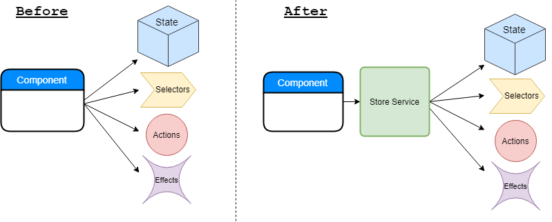

# @ngxp/store-service

Adds an abstraction layer between Angular components and the [@ngrx](https://github.com/ngrx/platform) store and effects. This decouples the components from the store, selectors, actions and effects and makes it easier to test components.

# Table of contents

* [Installation](#installation)
* [Comparison](#comparison)
    * [Before](#before)
    * [After](#after)
* [Documentation](#documentation)
    * [StoreService](#storeservice)
    * [Selectors](#selectors)
    * [Actions](#actions)
    * [Observers](#observers)
        * [Observe multiple types](#multiple-types)
        * [Use objects with type property](#objects-with-type-property)
        * [Custom toPayload mapper](#custom-topayload-mapper)
* [Prerequisites](#prerequisites)
    * [Selectors are functions](#selectors-are-functions)
    * [Actions are classes](#actions-are-classes)
* [Testing](#testing)
    * [Testing Selectors](#testing-selectors)
    * [Testing Actions](#testing-actions)
    * [Testing Observers](#testing-observers)
        * [StoreServiceMock](#storeservicemock)
        * [MockActions](#mockactions)
* [Examples](#examples)
    * [Example Store Service](#example-store-service)
    * [Example Tests](#example-tests)

# Installation

Get the latest version from NPM 
> The current version requires Angular 8 & Ngrx 8

```sh
npm install @ngxp/store-service
```

# Comparison


## Before

> Component

```ts
import { Component } from '@angular/core';
import { Observable } from 'rxjs';
import { Book } from 'src/app/shared/books/book.model';
// Tight coupling to ngrx, state model, selectors and actions
import { Store } from '@ngrx/store'; 
import { Actions, ofType } from '@ngrx/effects'; 
import { AppState } from 'src/app/store/appstate.model';
import { getAllBooks, getBook } from 'src/app/store/books/books.selectors'; 
import { addBookAction, booksLoadedAction } from 'src/app/store/books/books.actions'; 
 
@Component({
    selector: 'nss-book-list',
    templateUrl: './book-list.component.html',
    styleUrls: ['./book-list.component.scss']
})
export class BookListComponent {

    books$: Observable<Book[]>;
    book$: Observable<Book>;
    booksLoaded: boolean = false;

    constructor(
        private store: Store<AppState>
        private actions: Actions
    ) {
        this.books$ = this.store.select(getAllBooks);
        this.book$ = this.store.select(getBook, { id: 0 });
        this.actions
            .pipe(
                ofType(booksLoadedAction),
                map(() => this.loaded = true)
            )
            .suscribe();
    }

    addBook(book: Book) {
        this.store.dispatch(addBookAction({ book }));
    }
}
```

## After

> Component

```ts
import { Component } from '@angular/core';
import { Observable } from 'rxjs';
import { Book } from 'src/app/shared/books/book.model';
import { BookStoreService } from 'src/app/shared/books/book-store.service'; 
// Reduced to just one dependency. Loose coupling

@Component({
    selector: 'nss-book-list',
    templateUrl: './book-list.component.html',
    styleUrls: ['./book-list.component.scss']
})
export class BookListComponent {

    books$: Observable<Book[]>;
    book$: Observable<Book>;
    booksLoaded: boolean = false;

    constructor(
        private bookStore: BookStoreService // <- StoreService
    ) {
        this.books$ = this.bookStore.getAllBooks(); // <- Selector
        this.book$ = this.bookStore.getBook({ id: 0 }); // <- Selector
        this.bookStore.booksLoaded$ // <-- Observer / Action stream of type
            .pipe(
                map(() => this.loaded = true)
            )
            .subscribe();
    }

    addBook(book: Book) {
        this.bookStore.addBook({ book }); // <- Action
    }
}
```

> BookStoreService

```ts
import { Injectable } from '@angular/core';
import { Select, StoreService, Dispatch, Selector, Dispatcher } from '@ngxp/store-service';
import { Observable } from 'rxjs';
import { Book } from 'src/app/shared/books/book.model';
import { getBooks } from 'src/app/store/books/books.selectors';
import { State } from 'src/app/store/store.model';
import { addBookAction, booksLoadedAction } from 'src/app/store/books/books.actions';

@Injectable()
export class BookStoreService extends StoreService<State> {

    @Select(getBooks) // <- Selector
    getAllBooks: Selector<typeof getBook>;

    @Select(getBook) // <- Selector
    getBook: Selector<typeof getBook>;

    @Dispatch(addBookAction) // <- Action
    addBook: Dispatcher<typeof addBookAction>;

    @Observe([booksLoadedAction])
    booksLoaded$: Observable<Book[]>; // <- Observer / Action stream
}
```


# Documentation

## StoreService

The `BookStoreService` Injectable class has to extend the `StoreService<State>` class where `State` is your ngrx state model.

```ts
import { StoreService } from '@ngxp/store-service';
import { AppState } from 'app/store/state.model';

@Injectable()
export class BookStoreService extends StoreService<AppState> {
    ...
}
```

## Selectors

To use selectors you add the `@Select(...)` decorator inside the `StoreService`. Provide the selector function inside the `@Select(...)` annotation:

```ts
// Define the selector function
export const selectAllBooks = createSelector(
    (state: State) => state.books;
};

//Or with props
export const selectBook = createSelector(
    (state: State, props: { id: number }) => state.books[id];
};
...

// Use the selector function inside the @Select(...) annotation
@Select(selectAllBooks)
allBooks: Selector<typeof selectAllBooks>; // () => Observable<Book[]>

@Select(selectBook)
book: Selector<typeof selectBook>; // (props: { id: number }) => Observable<Book>
```
The `Selector<...>` type automatically infers the correct typing according to the props and return type of the selector.


## Actions

To dispatch actions add a property with the `@Dispatch(...)` annotation.

```ts
// Defined the Action as a class
export const loadBooksAction = createAction('[Books] Load books');

export const addBookAction = createAction('[Books] Add book' props<{ book: Book}>())
...
// Use the Action class inside the @Dispatch(...) annotation
@Dispatch(loadBooksAction)
loadBooks: Dispatcher<typeof loadBooksAction>; // () => void

@Dispatch(addBookAction)
addBook: Dispatcher<typeof addBookAction>; // (props: { book: Book }) => void
```

The `Dispatcher<...>` type automatically infers the parameters according to the props of the action.


## Observers

Observers are a way to listen for specific action types on the `Actions` stream from [@ngrx/effects](https://github.com/ngrx/platform/blob/master/docs/effects/README.md).

```ts
@Observe([booksLoadedAction])
booksLoaded$: Observable<Book[]>;
```

### Multiple types
You can provide multiple types, just like in the `ofType(...)` pipe.

```ts
@Observe([booksLoadedAction, booksLoadFailedAction])
booksLoaded$: Observable<Book[] | string>;
```

### Objects with type property
Objects with a `type` property are also valid.

```ts
const action = { type: 'booksLoaded' };
...
@Observe([action])
booksLoaded$: Observable<Book[]>;
```

### Custom mapper
The `@Observe(...)` decorator has an additional parameter to provide a custom `customMapper` mapping function.
Initially this will be:
```ts
action => action
```

To use a custom mapper, provide it as second argument in the `@Observe(...)` annotation.

```ts
export const toData = action => action.data;

...
@Observe([dataLoadedAction], toData)
dataLoaded$: Observable<Data>;
```
  
# Prerequisites

## Use props for parameters in selectors

The `StoreService` uses the suggested way of passing props to selectors as defined by the NgRx team.
So you need to create your selectors accordingly.


```ts
export const selectoFn = createSelector(
    selectFeature,
    (state: FeatureState, props: { propA: number, propB: string }) => { ... }
)

this.store.select(selectorFn, { propA: 0, propB: 'a'})
```

# Testing
Testing your components and the StoreService is easy. The `@ngxp/store-service/testing` package provides useful test-helpers to reduce testing friction.

## Testing Selectors

To test selectors you provide the `StoreService` using the `provideStoreServiceMock` method in the testing module of your component. Then cast the store service instance using the `StoreServiceMock<T>` class to get the correct typings.


```ts
import { provideStoreServiceMock, StoreServiceMock } from '@ngxp/store-service/testing';
...
let bookStoreService: StoreServiceMock<BookStoreService>;
...
TestBed.configureTestingModule({
    imports: [AppModule],
    providers: [
        provideStoreServiceMock(BookStoreService)
    ]
})
...
bookStoreService = TestBed.get(BookStoreService);
```

The `StoreServiceMock` class replaces all selector functions on the store service class with a `BehaviorSubject`. So now you can do the following to emit new values to the observables:

```ts
bookStoreService.getAllBooks().next(newBooks);
```

The `BehaviorSubject` is initialized with the value being `undefined`. If you want a custom initial value, the `provideStoreServiceMock` method offers an optional parameter. This is an object of key value pairs where the key is the name of the selector function, e.g. `getAllBooks`.

```ts
import { provideStoreServiceMock, StoreServiceMock } from '@ngxp/store-service/testing';
...
let bookStoreService: StoreServiceMock<BookStoreService>;
...
TestBed.configureTestingModule({
    imports: [AppModule],
    providers: [
        provideStoreServiceMock(BookStoreService, {
            getAllBooks: []
        })
    ]
})
...
bookStoreService = TestBed.get(BookStoreService);
```

The `BehaviorSubject` for `getAllBooks` is now initialized with an empty array instead of `undefined`.

## Testing Actions

To test if a component dispatches actions, you import the `provideMockStore` from ngrx inside the testing module.

```ts
import { provideMockStore, MockStore } from '@ngrx/store/testing';
...
let mockStore: MockStore<any>;
...
TestBed.configureTestingModule({
    imports: [
        BookStoreService,
        provideMockStore()
    ]
})
...
mockStore = TestBed.get(Store);
...
it('dispatches a new addBookAction', () => {
    const book: Book = getBook();
    bookStoreService.addBook({ book });

    const expected = cold('a', { a: addBookAction({ book }) });
    expect(mockStore.scannedActions$).toBeObservable(expected);
});
```

## Testing Observers

There are two different ways to test Observers depending on what you want to test. You can either use the `StoreServiceMock` or the `provideMockActions` from ngrx itself. The `StoreServiceMock` replaces all Observers inside the `StoreService` with a `BehaviorSubject`. This should be used for component tests. The `provideMockActions` provide a custom `Actions` subject you can emit new actions to. This should be used to test the `StoreService` itself.

### StoreServiceMock

To test observers inside components you provide the `StoreService` using the `provideStoreServiceMock` method in the testing module of your component. Then cast the store service instance using the `StoreServiceMock<T>` class to get the correct typings.


```ts
import { provideStoreServiceMock, StoreServiceMock } from '@ngxp/store-service/testing';
...
let bookStoreService: StoreServiceMock<BookStoreService>;
...
TestBed.configureTestingModule({
    imports: [AppModule],
    providers: [
        provideStoreServiceMock(BookStoreService)
    ]
})
...
bookStoreService = TestBed.get(BookStoreService);
```

The `StoreServiceMock` class replaces all observer properties on the store service class with a `BehaviorSubject`. So now you can do the following to emit new values to the subscribers:

```ts
bookStoreService.booksLoaded$.next(true);
```

The `BehaviorSubject` is initialized with the value being `undefined`. If you want a custom initial value, the `provideStoreServiceMock` method offers an optional parameter. This is an object of key value pairs where the key is the name of the observer property, e.g. `booksLoaded$`.

```ts
import { provideStoreServiceMock, StoreServiceMock } from '@ngxp/store-service/testing';
...
let bookStoreService: StoreServiceMock<BookStoreService>;
...
TestBed.configureTestingModule({
    imports: [AppModule],
    providers: [
        provideStoreServiceMock(BookStoreService, {
            booksLoaded$: false
        })
    ]
})
...
bookStoreService = TestBed.get(BookStoreService);
```

The `BehaviorSubject` for `booksLoaded$` is now initialized with `false` instead of `undefined`.


### provideMockActions

To test the observers / actions stream, you import the `provideMockActions` from `@ngrx/effects/testing` inside the testing module.


```ts
import { provideMockActions } from '@ngrx/effects/testing';
...
const mockActions = new BehaviorSubject(undefined);
...
TestBed.configureTestingModule({
    imports: [
        provideMockActions(mockActions)
    ]
})
```

Here is an example on how to test this using the `provideMockActions` class.

```ts
import { provideMockActions } from '@ngrx/effects/testing';
...
const mockActions = new BehaviorSubject(undefined);
...
TestBed.configureTestingModule({
    imports: [
        provideMockActions(mockActions)
    ]
})
...
it('test', () => {
    const expectedValue = [ { author: 'Author', title: 'Title', year: 2018 } ];
    const action = booksLoadedAction({ books: expectedValue });

    mockActions.next(action);

    const expected = cold('a', { a: expectedValue });
    expect(storeService.booksLoaded$).toBeObservable(expected);
})
```

# Examples

For detailed examples of all this have a look at the Angular Project in [the src/app folder](src/app).

## Example Store Service

Have a look at the [BookStoreService](src/app/shared/books/book-store.service.ts)

## Example Tests

For examples on Component Tests please have look at the test for the [BookListComponent](src/app/components/book-list/book-list.component.spec.ts) and the [NewBookComponent](src/app/components/new-book/new-book.component.spec.ts)

Testing the `StoreService` is also very easy. For an example have a look at the [BookStoreService](src/app/shared/books/book-store.service.spec.ts)
